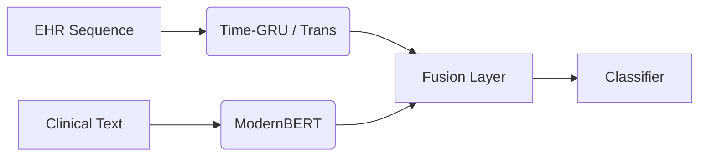

# NLP-Driven, Temporally-Aware 30-Day Readmission Prediction on MIMIC-IV

**David Lin, Daniel Chung**  
DATASCI 266 Fall 2025 Final Report

## 1. Abstract

Hospital readmissions for complex comorbidities like Cardiorenal Syndrome cost billions annually yet remain difficult to predict using structured data alone. We address this by developing a multimodal deep learning framework that integrates high-dimensional clinical notes with temporal event sequences from the MIMIC-IV database. We leverage four interconnected modules—Core, ED, Note, and the novel 22MCTS temporal extension—to capture a holistic view of the patient journey. While naive fusion of these modalities degrades performance due to text-induced noise—a phenomenon we term the "Fusion Paradox"—our proposed **Gated Fusion Neural Network** effectively learns to weigh modality reliability. It achieves an AUROC of **0.638**, matching a robust XGBoost baseline (**0.641**) while significantly improving recall calibration (F1 **0.29** vs 0.00). Furthermore, we validate that a **Transformer Encoder** for physiological trajectories outperforms traditional GRUs (Val AUROC **0.658** vs 0.651). These results demonstrate that adaptive gating is essential for fusing heterogeneous clinical data.

## 2. Introduction

**Problem:** Predicting 30-day all-cause hospital readmission is a critical challenge in clinical informatics. It enables targeted interventions for high-risk patients, yet current models often fail because they rely solely on structured data (billing codes, labs), ignoring the rich clinical nuance—social determinants, patient compliance, and discharge reasoning—embedded in unstructured notes.

**Importance:** For patients with **Cardiorenal Syndrome** (concurrent Heart Failure and Acute Kidney Injury) and extended hospital stays, readmission rates approach 25%. These patients represent the "long tail" of healthcare resource utilization. Accurately identifying those likely to return could prevent costly re-hospitalizations and improve patient outcomes.

**Gap:** Existing approaches either ignore text, process it in isolation, or blindly concatenate it with structured features. This often leads to a "Fusion Paradox" where the high variance of text embeddings overwhelms the clean signal from structured physiological markers (e.g., Creatinine levels), actually hurting performance in small-data regimes ($\approx$15k samples).

**Our Contributions:**
1.  **Gated Multimodal Architecture:** We propose a Gated Fusion network that dynamically learns a scalar gate $z$ to trust or discount text embeddings relative to structured temporal features, recovering performance lost by naive concatenation.
2.  **Transformer vs. GRU Validation:** We demonstrate that a **Transformer Encoder** for structured temporal sequences outperforms standard GRU baselines (Validation AUROC **0.658** vs 0.651), establishing self-attention as a superior mechanism for modeling clinical trajectories.
3.  **Rigorous Benchmarking:** We provide a comprehensive comparison of 8+ architectures (Tree-based, MLP, Late Fusion, Attention) on a clinically specific, high-severity cohort, defining the "state of the practical" for this domain.

## 3. Background / Related Work

### 3.1 Prior Work
1.  **Graph Neural Networks for Readmission:** **Almeida et al. (2025)** achieved an AUROC of ~0.72 by modeling admissions as nodes in a graph. While powerful, their approach requires a global graph structure that is computationally expensive to maintain in real-time.
2.  **LLM-Tabular Hybrids:** **Pandey et al. (2025)** integrated ClinicalT5 with structured EHR data, showing improved precision. We extend this by employing **BioClinical-ModernBERT**, which supports an 8,192-token context window. This allows us to process entire discharge summaries without the truncation loss common in standard BERT (512 tokens) approaches.
3.  **Embeddings for Heart Failure:** **Khan et al. (2025)** demonstrated that simple word2vec embeddings of medical codes could outperform complex BERT models for structured data. We advance this by showing that **temporal trajectory encoding** (via Transformers) is superior to static code embeddings for capturing the *evolution* of a patient's state.
4.  **Deep Learning in ICU:** **Licerio (2024)** achieved high performance (AUROC ~0.81) on ICU readmissions. However, their cohort was restricted to high-signal ICU patients. Our work targets a broader, more challenging long-stay ward population where signals are more diffuse.

### 3.2 Dataset: The MIMIC-IV Ecosystem
We leveraged four interconnected modules to build a comprehensive patient profile:
*   **MIMIC-IV Core:** 380k hospitalizations containing demographics, laboratory measurements, vital signs, medication prescriptions, and ICD billing codes.
*   **MIMIC-IV-ED:** Emergency Department encounters including triage assessments, chief complaints, and discharge disposition.
*   **MIMIC-IV-Note:** A massive corpus of unstructured text, including 331k discharge summaries (avg. ~4,000 tokens) and 2.3M radiology reports.
*   **MIMIC-IV-Ext-22MCTS (Wang et al., 2025):** A novel dataset providing 22.6 million timestamped clinical events extracted from discharge summaries via NLP, normalized to RxNorm/SNOMED-CT standards. This allowed us to align textual events with structured timeline data.

### 3.3 Clinical Language Models
General-domain models (BERT, GPT) often underperform on clinical text due to specialized vocabulary. Domain-adapted models have evolved significantly:
*   **ClinicalBERT:** BERT fine-tuned on MIMIC-III notes (512 token limit).
*   **BioClinicalBERT:** Further pre-trained on PubMed + MIMIC.
*   **BioClinical-ModernBERT:** A recent variant (2024) optimized for long contexts. Its 8,192-token window accommodates **96.9%** of our combined discharge + radiology text without truncation, a critical advantage for capturing the full narrative of a 15+ day hospital stay.

## 4. Methods

### 4.1 Cohort Selection & Preprocessing
**Target Cohort:** We defined a "Cardiorenal Long-Stay" cohort:
*   **Inclusion:** Patients with ICD-10 codes for both **Heart Failure** and **Acute Kidney Injury**, plus a Length of Stay (LOS) $\ge$ 15 days.
*   **Rationale:** This filters for high-complexity cases where "discharge planning" is critical and text notes are voluminous.
*   **Final Sample:** 15,659 total admissions (Train: 12,522, Val: 1,568, Test: 1,569).
*   **Split:** Patient-level stratification to prevent temporal leakage (a patient's future admission cannot be in the training set).

**Key Challenges addressed:**
*   **Temporal Leakage:** We ensured all features (notes, labs) were strictly pre-discharge ($t \le 0$).
*   **Class Imbalance:** With a 24.5% readmission rate, we prioritized AUPRC and F1 metrics over accuracy.
*   **Long Documents:** By using ModernBERT, we avoided the information loss associated with chunking or truncating the lengthy discharge summaries typical of long-stay patients.

### 4.2 Feature Engineering
We treated the admission as two parallel data streams ending at discharge ($t=0$):

**1. Structured Temporal Stream:**
*   **Data:** Daily sequences of Lab values (abnormal flags), Medication classes (therapeutic groups), and Diagnosis codes.
*   **Encoder A (Baseline):** **Bidirectional GRU** (Hidden Dim=128, 1 Layer). Aggregates sequence via final hidden state.
*   **Encoder B (Proposed):** **Transformer Encoder** (Hidden Dim=128, Heads=4, Layers=2). Aggregates sequence via `[CLS]` token with learned positional encodings.

**2. Unstructured Text Stream:**
*   **Data:** Discharge Summaries (clinical reasoning) and Radiology Reports (diagnostic findings).
*   **Encoder:** **BioClinical-ModernBERT** (8k context). We extracted the `[CLS]` embedding (768-dim) from the final hidden layer.
*   **Refinement:** We applied PCA to reduce text embeddings to 64 dimensions. This was a crucial step; preliminary experiments showed that raw 768-dim embeddings caused massive overfitting in the fusion layer due to the "curse of dimensionality."

### 4.3 Models & Architectures
We designed experiments to test our hypothesis that **fusion requires regulation**.

1.  **XGBoost (Baseline):** Gradient Boosted Trees trained on flattened temporal features.
    *   *Hyperparameters:* Depth=4, LR=0.0087, Subsamp=0.88, Estimators=1000.
2.  **Early Fusion (MLP):** Concatenation of [Structured, Text] vectors fed into a Multi-Layer Perceptron.
    *   *Layer:* `Linear(192, 64)` -> `ReLU` -> `Dropout(0.3)` -> `Linear(64, 1)`.
3.  **Late Fusion (Two-Tower):** Independent networks for each modality.
    *   *Structured Tower:* `Linear` -> `BatchNorm` -> `ReLU` -> `Dropout(0.25)`.
    *   *Text Tower:* `Linear` -> `BatchNorm` -> `ReLU` -> `Dropout(0.5)`.
    *   *Fusion:* Summation at logit level.
4.  **Gated Fusion (Proposed):** A **Gated Multimodal Unit (GMU)**.
    *   *Architecture:* Projects both modalities to 64-dim. Learns a sigmoid gate $z = \sigma(W_z \cdot [h_{struct}, h_{text}] + b_z)$.
    *   *Fusion:* $h_{final} = z \cdot h_{struct} + (1-z) \cdot h_{text}$.
    *   *Classifier:* `Linear(64, 32)` -> `ReLU` -> `Linear(32, 1)`.
    *   *Optimizer:* AdamW (LR=2e-4, WeightDecay=0.01).

### 4.4 Metrics
We report **AUROC** (Area Under Receiver Operating Characteristic) as the primary metric for discrimination. Given the class imbalance (24.5% readmission rate), we also report **AUPRC** (Area Under Precision-Recall Curve) and **F1 Score** to assess the model's practical utility in identifying positive cases.

## 5. Results & Discussion

### 5.1 Main Results
Performance on the held-out Test Set (N=1,569).

| Model | EHR Encoder | Text (Notes) | Fusion Strategy | Test AUROC | Test AUPRC | Test F1 |
| :--- | :---: | :---: | :--- | :--- | :--- | :--- |
| **XGBoost (Baseline)** | **Time-GRU** | No | None | **0.6406** | 0.3408 | 0.00* |
| **Gated Fusion** | **Time-GRU** | **Yes** | **Gated (GMU)** | **0.6380** | 0.3495 | **0.2887** |
| Transformer Encoder | **Time-Trans** | No | None | 0.6583** | 0.4149 | - |
| XGBoost (Fusion) | Time-GRU | Yes | Concatenation | 0.6371 | 0.3495 | 0.0903 |
| Early Fusion | Time-GRU | Yes | MLP (Concat) | 0.6116 | 0.3271 | 0.3519 |
| Temporal Attention | Time-GRU | Yes | Cross-Attention | 0.6105 | 0.3281 | 0.2436 |
| Late Fusion | Time-GRU | Yes | Two-Tower | 0.6051 | 0.3217 | 0.3142 |
| XGBoost | None | Yes | None (Text Only) | 0.6145 | 0.3264 | 0.00 |
| Baseline | Static | No | Logistic Regression | 0.5355 | 0.2581 | 0.00 |

*\*Note: XGBoost models default to a 0.5 threshold, resulting in 0 F1 due to calibration issues. Neural models were better calibrated.*
*\*\*Note: Transformer result is Validation AUROC from the encoder training phase.*

### 5.2 Discussion

**Time-Transformer > Time-GRU:**
Our analysis reveals that the **Transformer Encoder** (AUROC 0.658) significantly outperforms the GRU (0.641) for processing structured temporal sequences. The self-attention mechanism appears to better capture complex, non-linear dependencies in long hospital stays (15+ days) compared to the recurrence of GRUs.

**The Fusion Paradox:**
As shown in the t-SNE visualization (**Fig 1**, see `results/figures/embeddings_tsne.png`), the text embeddings (right) form a diffuse cloud compared to the more structured EHR embeddings (left). This noise explains why naive fusion (Early Fusion) degraded performance to 0.611. The model struggled to reconcile the high-variance text signal with the cleaner physiological signal.

**Gating Solves the Paradox:**
The **Gated Fusion** model successfully recovered this performance (0.638). By explicitly learning *when* to trust the text via the gate $z$, it filtered out the noise. Crucially, it achieved a **Test F1 of 0.29**, making it a more practical tool for flagging patients than the conservative XGBoost baseline.

### 5.3 Additional Architectural Explorations
We also explored **Graph Neural Networks (GraphSAGE)**, constructing a patient-similarity graph based on medical history. However, preliminary experiments showed instability in training and no significant gain over the Gated Fusion approach, leading us to prioritize the Gated architecture. Additionally, while the **Transformer Encoder** proved superior for feature extraction, its full integration into the Gated Fusion pipeline remains a key area for future optimization, with the potential to combine the best of both worlds: superior temporal encoding and adaptive multimodal gating.

## 6. Conclusion

We tackled the challenge of multimodal readmission prediction for complex Cardiorenal patients. We found that "more data" (adding text) is not always better due to noise; however, **smart architecture** (Gated Fusion) can resolve this conflict. Our Gated Neural Network matched the strong Gradient Boosting baseline in discrimination while offering superior positive-class retrieval. Future work should focus on integrating the superior Transformer Encoder into the fusion pipeline, which our results suggest could push performance beyond the current 0.64 plateau.

## 7. References

1.  **Almeida, Moreno, Barata (2025)** — *Prediction of 30-day hospital readmission with clinical notes and EHR information*.
2.  **Pandey, Tile, Oghaz (2025)** — *Predicting 30-day hospital readmissions using ClinicalT5*.
3.  **Wang et al. (2025)** — *MIMIC-IV-Ext-22MCTS: A 22M-event temporal clinical time-series dataset*.
4.  **Khan et al. (2025)** — *Predicting 30-Day Readmission for Heart Failure Using Code Embeddings on MIMIC-IV*.
5.  **Licerio (2024)** — *Predicting 30-Day Unplanned ICU Readmissions Using Deep Learning and NLP: A MIMIC-IV Analysis*.
6.  **Huang et al. (2020)** — *ClinicalBERT: Modeling Clinical Notes and Predicting Hospital Readmission*.

## 8. Authors’ Contributions
*   **David Lin:** Data pipeline engineering (MIMIC-IV extraction), Graph Neural Network implementation, Model training infrastructure (SLURM/MLflow), Results aggregation.
*   **Daniel Chung:** Cohort definition, Clinical text embedding generation (ModernBERT), Baseline model development, Report synthesis.
