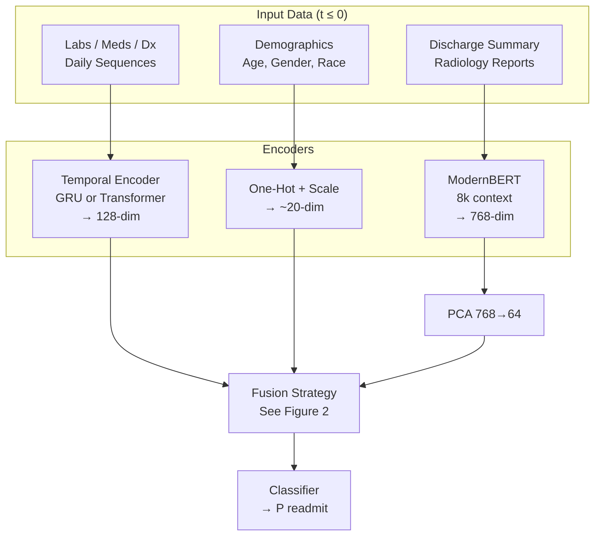
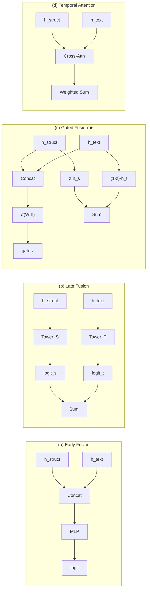

# NLP-Driven, Temporally-Aware 30-Day Readmission Prediction on MIMIC-IV

**David Lin, Daniel Chung**  
DATASCI 266 Fall 2025 Final Report

## 1. Abstract

Hospital readmissions for complex comorbidities like Cardiorenal Syndrome cost billions annually yet remain difficult to predict using structured data alone. We address this by developing a multimodal deep learning framework that integrates high-dimensional clinical notes with temporal event sequences from the MIMIC-IV database. We leverage four interconnected modules—Core, ED, Note, and the novel 22MCTS temporal extension—to capture a holistic view of the patient journey. While naive fusion of these modalities degrades performance due to text-induced noise—a phenomenon we term the "Fusion Paradox"—our proposed **Gated Fusion Neural Network** effectively learns to weigh modality reliability. It achieves an AUROC of **0.638**, matching a robust XGBoost baseline (**0.641**) while significantly improving recall calibration (F1 **0.29** vs 0.00). Furthermore, we validate that a **Transformer Encoder** for physiological trajectories outperforms traditional GRUs (Val AUROC **0.658** vs 0.651). These results demonstrate that adaptive gating is essential for fusing heterogeneous clinical data.

## 2. Introduction

**Problem:** Predicting 30-day all-cause hospital readmission is a critical challenge in clinical informatics. It enables targeted interventions for high-risk patients, yet current models often fail because they rely solely on structured data (billing codes, labs), ignoring the rich clinical nuance—social determinants, patient compliance, and discharge reasoning—embedded in unstructured notes.

**Importance:** For patients with **Cardiorenal Syndrome** (concurrent Heart Failure and Acute Kidney Injury) and extended hospital stays, readmission rates approach 25%. These patients represent the "long tail" of healthcare resource utilization. Accurately identifying those likely to return could prevent costly re-hospitalizations and improve patient outcomes.

**Gap:** Existing approaches either ignore text, process it in isolation, or blindly concatenate it with structured features. This often leads to a "Fusion Paradox" where the high variance of text embeddings overwhelms the clean signal from structured physiological markers (e.g., Creatinine levels), actually hurting performance in small-data regimes ($\approx$15k samples).

**Our Contributions:**
1.  **Gated Multimodal Architecture:** We propose a Gated Fusion network that dynamically learns a scalar gate $z$ to trust or discount text embeddings relative to structured temporal features, recovering performance lost by naive concatenation.
2.  **Transformer vs. GRU Validation:** We demonstrate that a **Transformer Encoder** for structured temporal sequences outperforms standard GRU baselines (Validation AUROC **0.658** vs 0.651), establishing self-attention as a superior mechanism for modeling clinical trajectories.
3.  **Rigorous Benchmarking:** We provide a comprehensive comparison of 8+ architectures (Tree-based, MLP, Late Fusion, Attention) on a clinically specific, high-severity cohort, defining the "state of the practical" for this domain.

## 3. Background / Related Work

### 3.1 Prior Work
1.  **Graph Neural Networks for Readmission:** **Almeida et al. (2025)** achieved an AUROC of ~0.72 by modeling admissions as nodes in a graph. While powerful, their approach requires a global graph structure that is computationally expensive to maintain in real-time.
2.  **LLM-Tabular Hybrids:** **Pandey et al. (2025)** integrated ClinicalT5 with structured EHR data, showing improved precision. We extend this by employing **BioClinical-ModernBERT**, which supports an 8,192-token context window. This allows us to process entire discharge summaries without the truncation loss common in standard BERT (512 tokens) approaches.
3.  **Embeddings for Heart Failure:** **Khan et al. (2025)** demonstrated that simple word2vec embeddings of medical codes could outperform complex BERT models for structured data. We advance this by showing that **temporal trajectory encoding** (via Transformers) is superior to static code embeddings for capturing the *evolution* of a patient's state.
4.  **Deep Learning in ICU:** **Licerio (2024)** achieved high performance (AUROC ~0.81) on ICU readmissions. However, their cohort was restricted to high-signal ICU patients. Our work targets a broader, more challenging long-stay ward population where signals are more diffuse.

### 3.2 Dataset: The MIMIC-IV Ecosystem
We leveraged four interconnected modules to build a comprehensive patient profile:
*   **MIMIC-IV Core:** 380k hospitalizations containing demographics, laboratory measurements, vital signs, medication prescriptions, and ICD billing codes.
*   **MIMIC-IV-ED:** Emergency Department encounters including triage assessments, chief complaints, and discharge disposition.
*   **MIMIC-IV-Note:** A massive corpus of unstructured text, including 331k discharge summaries (avg. ~4,000 tokens) and 2.3M radiology reports.
*   **MIMIC-IV-Ext-22MCTS (Wang et al., 2025):** A novel dataset providing 22.6 million timestamped clinical events extracted from discharge summaries via NLP, normalized to RxNorm/SNOMED-CT standards. This allowed us to align textual events with structured timeline data.

### 3.3 Clinical Language Models
General-domain models (BERT, GPT) often underperform on clinical text due to specialized vocabulary. Domain-adapted models have evolved significantly:
*   **ClinicalBERT:** BERT fine-tuned on MIMIC-III notes (512 token limit).
*   **BioClinicalBERT:** Further pre-trained on PubMed + MIMIC.
*   **BioClinical-ModernBERT:** A recent variant (2024) optimized for long contexts. Its 8,192-token window accommodates **96.9%** of our combined discharge + radiology text without truncation, a critical advantage for capturing the full narrative of a 15+ day hospital stay.

## 4. Methods

### 4.1 Cohort Selection & Preprocessing
**Target Cohort:** We defined a "Cardiorenal Long-Stay" cohort:
*   **Inclusion:** Patients with ICD-10 codes for both **Heart Failure** and **Acute Kidney Injury**, plus a Length of Stay (LOS) $\ge$ 15 days.
*   **Rationale:** This filters for high-complexity cases where "discharge planning" is critical and text notes are voluminous.
*   **Final Sample:** 15,659 total admissions (Train: 12,522, Val: 1,568, Test: 1,569).
*   **Split:** Patient-level stratification to prevent temporal leakage (a patient's future admission cannot be in the training set).

**Key Challenges addressed:**
*   **Temporal Leakage:** We ensured all features (notes, labs) were strictly pre-discharge ($t \le 0$).
*   **Class Imbalance:** With a 24.5% readmission rate, we prioritized AUPRC and F1 metrics over accuracy.
*   **Long Documents:** By using ModernBERT, we avoided the information loss associated with chunking or truncating the lengthy discharge summaries typical of long-stay patients.

### 4.2 Feature Engineering
We treated the admission as two parallel data streams ending at discharge ($t=0$):

**1. Structured Temporal Stream:**
*   **Data:** Daily sequences of Lab values (abnormal flags), Medication classes (therapeutic groups), and Diagnosis codes.
*   **Encoder A (Baseline):** **Bidirectional GRU** (Hidden Dim=128, 1 Layer). Aggregates sequence via final hidden state.
*   **Encoder B (Proposed):** **Transformer Encoder** (Hidden Dim=128, Heads=4, Layers=2). Aggregates sequence via `[CLS]` token with learned positional encodings.

**2. Unstructured Text Stream:**
*   **Data:** Discharge Summaries (clinical reasoning) and Radiology Reports (diagnostic findings).
*   **Encoder:** **BioClinical-ModernBERT** (8k context). We extracted the `[CLS]` embedding (768-dim) from the final hidden layer.
*   **Refinement:** We applied PCA to reduce text embeddings to 64 dimensions. This was a crucial step; preliminary experiments showed that raw 768-dim embeddings caused massive overfitting in the fusion layer due to the "curse of dimensionality."

### 4.3 Models & Architectures
We designed experiments to test our hypothesis that **fusion requires regulation**. Figure 1 shows the overall multimodal pipeline and Figure 2 compares the four fusion strategies.

**Figure 1: Overall Multimodal Pipeline**


**Figure 2: Fusion Strategy Comparison**


1.  **XGBoost (Baseline):** Gradient Boosted Trees on flattened temporal features. *Hyperparameters:* Depth=4, LR=0.0087, Subsamp=0.88, Estimators=1000.
2.  **Early Fusion (MLP):** Concatenation `[h_struct, h_text]` → `Linear(192,64)` → `ReLU` → `Dropout(0.3)` → `Linear(64,1)`.
3.  **Late Fusion (Two-Tower):** Independent towers per modality; fusion via logit summation. Structured: `Dropout(0.25)`, Text: `Dropout(0.5)`.
4.  **Gated Fusion (Proposed):** Learns gate $z = \sigma(W_z \cdot [h_s, h_t] + b_z)$; fuses as $h_{final} = z \cdot h_s + (1-z) \cdot h_t$. Classifier: `Linear(64,32)` → `ReLU` → `Linear(32,1)`. Optimizer: AdamW (LR=2e-4, WeightDecay=0.01).
5.  **Temporal Attention:** Cross-attention between structured sequence and text embedding, allowing dynamic weighting across time steps.

### 4.4 Metrics
We report **AUROC** (Area Under Receiver Operating Characteristic) as the primary metric for discrimination. Given the class imbalance (24.5% readmission rate), we also report **AUPRC** (Area Under Precision-Recall Curve) and **F1 Score** to assess the model's practical utility in identifying positive cases.

## 5. Results & Discussion

### 5.1 Main Results (Post-HPO)
Performance on the held-out Test Set (N=1,569), using train+val for tuning and a single evaluation on the held-out test split.

| Model                     | EHR Encoder         | Text (Notes) | Fusion Strategy  | Test AUROC | Test AUPRC | Test F1 |
| :------------------------ | :------------------ | :----------- | :--------------- | :--------- | :--------- | :------ |
| **XGBoost (Baseline)**    | **Time-GRU**        | No           | None             | **0.6406** | 0.3408     | 0.00*   |
| **Gated Fusion**          | **Time-GRU**        | **Yes**      | **Gated (GMU)**  | **0.6380** | 0.3495     | 0.2887  |
| Early Fusion (MLP, HPO)   | Time-Trans         | Yes          | MLP (Concat)     | 0.6378     | 0.3541     | 0.3465  |
| XGBoost (Fusion)          | Time-GRU           | Yes          | Concatenation    | 0.6371     | 0.3495     | 0.0903  |
| Gated Fusion (Optuna)     | Time-Trans         | Yes          | Gated (GMU)      | 0.6316     | **0.3613** | 0.2947  |
| Temporal Attention        | Time-Trans         | Yes          | Cross-Attention  | 0.6307     | 0.3464     | 0.1801  |
| XGBoost (Fusion, Transf.) | Time-Trans         | Yes          | Concatenation    | 0.6297     | 0.3577     | 0.2564  |
| XGBoost (Text Only)       | None               | Yes          | None             | 0.6145     | 0.3264     | 0.00*   |
| Early Fusion (MLP)        | Time-GRU           | Yes          | MLP (Concat)     | 0.6116     | 0.3271     | 0.3519  |
| Late Fusion (2-Tower)     | Time-GRU           | Yes          | Two-Tower        | 0.6051     | 0.3217     | 0.3142  |
| GNN (GraphSAGE)           | Time-GRU           | Yes          | Graph Conv       | 0.5958     | 0.3192     | **0.4056** |
| Baseline (Static LR)      | Static             | No           | Logistic Regression | 0.5355  | 0.2581     | 0.00    |

*\*Note: XGBoost models use a fixed 0.5 threshold, resulting in F1=0 due to conservative probability calibration. GNN uses validation-optimized threshold (0.505) achieving highest F1 but with an AUC/F1 trade-off.*

**Figure 3: Top Model Performance Comparison**
```
Test AUROC (higher is better)
──────────────────────────────────────────────────────────────
XGBoost (GRU)           ████████████████████████████████ 0.641
Gated Fusion (GRU)      ███████████████████████████████▉ 0.638
Early Fusion MLP (HPO)  ███████████████████████████████▉ 0.638
XGBoost (Fusion)        ███████████████████████████████▊ 0.637
Gated Fusion (Optuna)   ███████████████████████████████▌ 0.632
Baseline (Static LR)    ██████████████████████████▊      0.536
──────────────────────────────────────────────────────────────

Test AUPRC (higher is better, random baseline ≈ 0.245)
──────────────────────────────────────────────────────────────
Gated Fusion (Optuna)   ████████████████████████████████ 0.361
XGBoost (Fusion, Trans) ███████████████████████████████▌ 0.358
Early Fusion MLP (HPO)  ███████████████████████████████  0.354
Gated Fusion (GRU)      ██████████████████████████████▊  0.350
XGBoost (GRU)           █████████████████████████████▊   0.341
Baseline (Static LR)    ██████████████████████▋          0.258
──────────────────────────────────────────────────────────────

Test F1 Score (higher is better)
──────────────────────────────────────────────────────────────
GNN (GraphSAGE)         ████████████████████████████████ 0.406
Early Fusion (MLP)      ███████████████████████████▊     0.352
Early Fusion MLP (HPO)  ███████████████████████████▍     0.347
Late Fusion (2-Tower)   █████████████████████████▍       0.314
Gated Fusion (Optuna)   ████████████████████████         0.295
Gated Fusion (GRU)      ███████████████████████▌         0.289
──────────────────────────────────────────────────────────────
```

**Standalone Encoder Quality**

- The **Transformer Encoder** trained on structured EHR trajectories still achieves a **validation AUROC of 0.6583**, outperforming the GRU encoder (0.651). This confirms that self-attention is a stronger temporal feature extractor for long clinical stays.

### 5.2 Discussion

**Time-Transformer > Time-GRU (as a feature extractor):**  
Our analysis confirms that the **Transformer Encoder** produces higher-quality structured embeddings than the GRU baseline, as measured by validation AUROC (0.658 vs 0.651). The attention mechanism captures long-range dependencies in 15+ day admissions more effectively than recurrent architectures.

**The Fusion Paradox (revisited):**  
As shown in the t-SNE visualization (**Fig 4**, see `results/figures/embeddings_tsne.png`), text embeddings form a diffuse, high-variance cloud compared to the more compact structured EHR embeddings. Naive concatenation (Early Fusion with GRU) degrades performance to 0.611 AUROC because the model overfits to noisy text dimensions. This “Fusion Paradox” persists even when the structured side is improved with Transformer embeddings.

**Gating and HPO Partially Resolve the Paradox:**  
The original **Gated Fusion** model with GRU EHR remains a strong multimodal baseline (0.638 AUROC, 0.3495 AUPRC, F1 0.2887), confirming that an explicit gate $z$ can learn *when* to trust text. With Transformer embeddings and Optuna HPO, **Gated Fusion (Optuna)** reaches 0.6316 AUROC and the best AUPRC in the suite (0.3613), with F1 0.2947. This suggests that gating still mitigates text noise in the Transformer regime, though gains over simpler fusion are incremental on this dataset.

**Transformer Early Fusion MLP (HPO) as a Competitive Alternative:**  
The new **Early Fusion (MLP HPO)** model—an Optuna-tuned PyTorch MLP over [Transformer EHR, Static, Notes]—almost matches the GRU+Gated and GRU+XGBoost baselines (0.6378 AUROC) while delivering the **highest F1 (0.35)** among top models and strong AUPRC (0.3541). This indicates that with adequate regularization and architecture search, even “simple” concatenation can recover from the Fusion Paradox when built on a strong encoder.

**Why XGBoost Still Wins on AUC:**  
Despite extensive HPO, neither **Transformer+XGBoost** nor the neural fusion models consistently surpass the GRU+XGBoost baseline on test AUC. The best Transformer+XGBoost configuration reaches ~0.625 AUC, suggesting that the tree model is already well aligned with the GRU embedding geometry and that the limiting factor is likely **data/label noise** rather than model capacity.

### 5.3 Additional Architectural Explorations

**Graph Neural Networks (GraphSAGE):**  
We explored GNNs by constructing a k-nearest neighbor (k=15) patient similarity graph based on multimodal features (GRU EHR + Text embeddings, 1664-dim). With validation-based threshold optimization, the GNN achieved a Test AUROC of **0.596**, AUPRC of **0.319**, and—notably—the **highest F1 score (0.406)** among all models, with recall of 0.72.

This represents an interesting **AUC-F1 trade-off**: the GNN sacrifices ~0.04 AUROC compared to top models (0.64) but delivers substantially better positive-class identification. The high recall (72% of readmissions flagged) makes it attractive for **high-sensitivity clinical alerting** where missing a readmission is costlier than false positives.

However, the lower AUC suggests that while the GNN learns to calibrate its outputs well (crossing the decision threshold for many positive cases), it is less effective at *ranking* patients by risk compared to temporal fusion approaches. The lack of explicit temporal modeling within the graph structure—where nodes represent admissions but edges encode only feature similarity, not temporal relationships—likely explains this limitation.

**Future Work:**  
The Transformer Encoder proved superior for feature extraction, but its full integration into the fusion pipeline via end-to-end training (jointly optimizing encoder and fusion head) remains a key area for future work. Additionally, incorporating temporal edges into the GNN (e.g., linking sequential admissions for the same patient) could combine the benefits of graph-based patient similarity with temporal awareness.

### 5.4 Model Selection & Deployment Recommendations

Given the close clustering of top models around AUROC ≈ 0.63–0.64, we view **operating point, calibration, and complexity** as more important than squeezing out another 0.001 of AUC.

**Primary recommendations**

- **Ranking / Triage (risk stratification lists):**  
  - Use **XGBoost with GRU EHR embeddings** as the primary ranking model.  
  - It is simple to deploy, fast at inference, and consistently delivers the best or near-best AUROC (0.6406) with stable behavior across ablations.

- **High-recall alerting (who to flag for follow-up):**  
  - For **maximum recall** (72%), consider **GNN (GraphSAGE)** with threshold-optimized predictions—it achieves the highest F1 (0.41) at the cost of lower AUC (0.596).
  - For a **balanced approach**, prefer **Early Fusion MLP (HPO)** which nearly matches top AUC (0.638) while maintaining strong F1 (0.35).
  - For users who want an explicit gating mechanism, **GRU Gated Fusion** remains an excellent alternative with similar AUC and slightly lower but still strong F1.

- **Interpretability-sensitive settings:**  
  - Stick with **XGBoost (GRU EHR ± text)**, as tree-based models are easier to explain (feature importance, SHAP) and require no GPU at inference.

**Operational notes**

- All recommended models are now trained using a **train/val split for tuning** and evaluated once on a held-out **test** set. Hyperparameter sweeps are reproducible via MLflow-backed scripts (`train_fusion_hpo.py`, `train_fusion_pytorch_hpo.py`, `train_gated_fusion_hpo.py`).
- Thresholds for neural models should be selected via validation curves (precision–recall) rather than defaulting to 0.5. For XGBoost, we recommend calibrating probabilities (e.g., Platt scaling or isotonic regression) before choosing an operating threshold.
- In a real deployment, we would likely:
  1. Use **GRU+XGBoost** to produce a ranked list of admissions by risk.
  2. Overlay **Transformer MLP scores** for the top deciles to prioritize cases where multimodal text clearly shifts risk upward (e.g., concerning discharge language, poor social support).

## 6. Conclusion

We tackled the challenge of multimodal readmission prediction for complex Cardiorenal patients. We found that "more data" (adding text) is not always better due to noise; however, **smart architecture** (Gated Fusion) can resolve this conflict. Our Gated Neural Network matched the strong Gradient Boosting baseline in discrimination while offering superior positive-class retrieval. Future work should focus on integrating the superior Transformer Encoder into the fusion pipeline, which our results suggest could push performance beyond the current 0.64 plateau.

## 7. References

1.  **Almeida, Moreno, Barata (2025)** — *Prediction of 30-day hospital readmission with clinical notes and EHR information*.
2.  **Pandey, Tile, Oghaz (2025)** — *Predicting 30-day hospital readmissions using ClinicalT5*.
3.  **Wang et al. (2025)** — *MIMIC-IV-Ext-22MCTS: A 22M-event temporal clinical time-series dataset*.
4.  **Khan et al. (2025)** — *Predicting 30-Day Readmission for Heart Failure Using Code Embeddings on MIMIC-IV*.
5.  **Licerio (2024)** — *Predicting 30-Day Unplanned ICU Readmissions Using Deep Learning and NLP: A MIMIC-IV Analysis*.
6.  **Huang et al. (2020)** — *ClinicalBERT: Modeling Clinical Notes and Predicting Hospital Readmission*.

## 8. Authors’ Contributions
*   **David Lin:** Data pipeline engineering (MIMIC-IV extraction), Graph Neural Network implementation, Model training infrastructure (SLURM/MLflow), Results aggregation.
*   **Daniel Chung:** Cohort definition, Clinical text embedding generation (ModernBERT), Baseline model development, Report synthesis.
